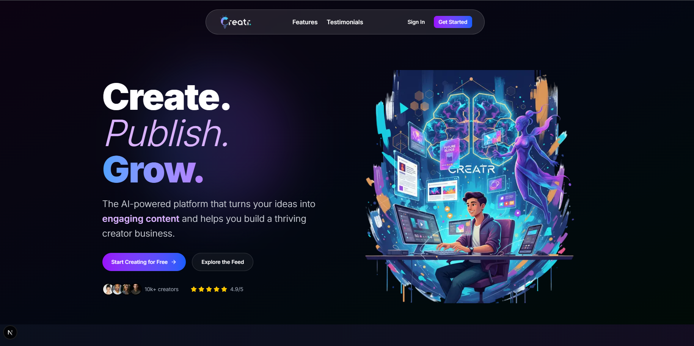

# Creatr — AI Creator Platform



Creatr is a full-stack, AI-powered content creation platform built for bloggers, marketers, and digital creators.  
It features a multi-provider AI failover system, a real-time backend powered by Convex, secure authentication via Clerk,  
and integrated media workflows using ImageKit.

The platform automates content generation and improvement using structured HTML output and smart enhancement modes,  
while ensuring near-zero downtime by automatically switching between AI providers when one reaches quota limits.

---

## **Table of Contents**

- [Overview & Core Features](#overview--core-features)
- [Multi-AI Failover Workflow](#multi-ai-failover-workflow)
- [High-Level Architecture](#high-level-architecture)
- [Technology Stack](#technology-stack)
- [Content Generation Flow](#content-generation-flow)
- [Project Structure](#project-structure)
- [Advantages & Limitations](#advantages--limitations)
- [Environment Variables & Configuration](#environment-variables--configuration)
- [Local Development Setup](#local-development-setup)

## **Overview & Core Features**

Creatr is designed to streamline the process of generating high-quality written content by leveraging multiple AI providers, real-time backend functions, and a modern frontend.  
It aims to eliminate common issues such as provider downtime, quota errors, and inconsistent output quality.

### **Core Features**

- **AI Blog Generation:**  
  Generates SEO-optimized blog posts with clean HTML formatting, including headings, lists, and structured paragraphs.

- **Content Enhancement Modes:**  
  Provides multiple improvement options such as *expand*, *simplify*, and *enhance* while preserving the writer’s tone and structure.

- **Multi-AI Failover Engine:**  
  Automatically switches between AI providers (OpenAI → Anthropic → Groq → HuggingFace → Gemini) to ensure uninterrupted content generation.

- **Real-Time Backend (Convex):**  
  Handles backend functions, data storage, and live updates without traditional server maintenance.

- **Secure Authentication (Clerk):**  
  Provides login, session management, and safe access to user-specific content.

- **Media Upload & Storage (ImageKit):**  
  Allows seamless image uploading with built-in optimization and CDN delivery.

- **Modern Frontend Architecture:**  
  Developed using Next.js App Router and Tailwind CSS for performance and scalability.

## **Multi-AI Failover Workflow**

Creatr incorporates a prioritized AI failover mechanism to ensure uninterrupted content generation.  
If one AI provider becomes unavailable or reaches its quota limit, the system transparently switches to the next provider in the sequence.

### **Failover Sequence**

1. **OpenAI**  
2. **Anthropic (Claude)**  
3. **Groq**  
4. **Hugging Face**  
5. **Google Gemini**

### **How It Works**

- When a generation request is made, Creatr first attempts to use the highest-priority provider.  
- If the request encounters an error (quota exceeded, timeout, provider offline), it automatically retries using the next provider.  
- This cascade continues until a successful response is received.  
- The user interface does not break or show provider-specific errors — the process is fully transparent to the user.

### **Benefits**

- **High Reliability:** Ensures content generation continues even during major provider outages.  
- **Zero Downtime:** Users never experience hard failures or blocked workflows.  
- **Consistent Output:** Maintains predictable performance across varying levels of AI service availability.  
- **Scalable:** Easily extendable to additional providers in the future.


## **High-Level Architecture**

Creatr consists of several coordinated components that work together to deliver a seamless AI-driven content generation experience.  
Each part of the system is designed for scalability, reliability, and ease of development.

### **Frontend (Next.js + React)**

- Manages the user interface, routing, and content editing workflows.  
- Interacts with backend actions for content generation and improvement.  
- Renders AI-generated HTML output and provides preview functionality.  
- Handles authenticated states via Clerk.

### **Backend & Database (Convex)**

- Acts as the core engine powering content generation logic.  
- Executes serverless functions including AI failover routing and caching.  
- Stores user content, metadata, and application state in a realtime database.  
- Provides automatic reactivity, enabling instant UI updates without polling.

### **AI Generation Layer**

- Unified AI interface that connects to five different providers:  
  **OpenAI → Anthropic → Groq → Hugging Face → Gemini**  
- Implements prioritized failover to guarantee uninterrupted responses.  
- Normalizes output across providers for consistent formatting.

### **Media Storage (ImageKit)**

- Handles image uploading, optimization, and CDN delivery.  
- Supports efficient preview and rendering inside the editor.

### **Authentication Layer (Clerk)**

- Provides user login, registration, and session management.  
- Ensures only authenticated users can generate or manage content.

### **Overall Workflow**

1. User submits content or a title from the frontend.  
2. Backend processes the request and selects the appropriate AI provider.  
3. The AI failover engine ensures a successful response from available providers.  
4. The resulting content is returned to the frontend and rendered in the editor.  
5. User may save, modify, or enhance the content using additional tools.


## **Technology Stack**

Creatr is built using a modern full-stack architecture that balances performance, scalability, and developer experience.  
The following components power the platform:

| **Component**   | **Technology**                                   | **Purpose**                                   |
|-----------------|---------------------------------------------------|-----------------------------------------------|
| Frontend        | Next.js, React, TailwindCSS                      | UI, routing, rendering, styling               |
| Backend         | Convex serverless functions                      | API logic, failover routing, realtime updates |
| Database        | Convex Realtime DB                               | Data storage and live state synchronization   |
| Authentication  | Clerk                                             | User login, sessions, identity management     |
| Media Storage   | ImageKit                                          | Image uploads, optimization, CDN delivery     |
| AI Providers    | OpenAI, Anthropic, Groq, Hugging Face, Gemini    | Content generation with automatic failover    |

This stack allows Creatr to deliver a responsive user experience while maintaining reliability during heavy or unpredictable AI workloads.

## **Content Generation Flow**

Creatr follows a structured pipeline to generate, enhance, and refine written content.  
The process ensures stable output even when switching between multiple AI providers.

### **1. User Input & Request Initialization**

- The user provides a blog title or pastes existing content.  
- Selects an operation such as *Generate*, *Enhance*, *Expand*, or *Simplify*.  
- The frontend sends the request to Convex along with the user’s session context.

### **2. Backend Processing (Convex)**

- Validates the input and determines which AI operation is required.  
- Passes the request to the AI failover system for processing.  
- Maintains logs for provider usage and errors.

### **3. AI Failover Execution**

- Attempts generation with the primary provider (OpenAI).  
- On failure, automatically retries with Anthropic → Groq → Hugging Face → Gemini.  
- Ensures that a valid response is returned without requiring user intervention.

### **4. Normalization & Formatting**

- The backend ensures consistent HTML formatting across providers.  
- Structures output into headings, paragraphs, and lists for readability.

### **5. Response Delivery**

- The final content is returned to the frontend.  
- Displayed inside the text editor or preview panel for user review.  
- Users may save, export, or further enhance the generated content.

This pipeline ensures that content generation remains fast, reliable, and consistent across different workloads and AI providers.

## Project Structure

The Creatr codebase is organized into a clean, modular structure that separates frontend logic, backend functions, utilities, and configuration files.

```txt
creatr/
├── app/                       # Next.js App Router pages and layouts
│   ├── (routes)/              # Application routes and views
│   ├── api/                   # Server actions and route handlers
│   ├── layout.tsx             # Root layout
│   └── components/            # Reusable React UI components
│
├── convex/                    # Convex backend logic and database functions
│   ├── functions/             # Business logic (AI, content operations)
│   ├── schema.ts              # Convex data schema
│   └── client.ts              # Convex client configuration
│
├── lib/                       # Core utilities and helper modules
│   ├── ai/                    # AI failover logic and provider wrappers
│   ├── utils.ts               # Shared utilities
│   └── validators.ts          # Input validation (if applicable)
│
├── public/                    # Static assets (icons, images)
│
├── styles/                    # Global CSS and Tailwind styles
│
├── .env.local.example         # Environment variable template
├── package.json               # Dependencies and scripts
└── README.md                  # Documentation
```

This structure ensures clean separation of responsibilities, simplifies development, and makes it easy to extend the platform with additional features in the future.


## **Advantages & Limitations**

Creatr is designed with reliability, flexibility, and ease of use in mind.  
The multi-AI failover engine, realtime backend, and modern architecture provide strong advantages, but certain limitations still apply.

---

### **Advantages**

- **High Reliability:**  
  The multi-provider failover system ensures that content generation continues even if one or more AI services reach quotas or experience downtime.

- **Consistent Output Quality:**  
  Normalized HTML formatting creates predictable, structured results across all providers.

- **Zero Backend Maintenance:**  
  Convex handles backend functions and database operations without requiring server setup or infrastructure management.

- **Fast and Modern UI:**  
  Next.js App Router with React provides a smooth, responsive user experience.

- **Optimized Media Storage:**  
  ImageKit offers efficient uploads, transformations, and CDN-level performance.

- **Secure Authentication:**  
  Clerk enables seamless login flows with strong session handling.

- **Scalable Architecture:**  
  Easily extendable to new AI providers, content types, templates, or editor features.

---

### **Limitations**

- **Dependent on Third-Party AI Providers:**  
  While failover reduces errors, Creatr still relies on external AI APIs for generation.

- **Rate Limits Vary per Provider:**  
  Different providers may enforce different quota rules, which can influence performance during heavy usage.

- **Editor Features Are Basic (Currently):**  
  Advanced features like version history, collaborative editing, and auto-saving may require additional development.

- **Media Support Limited to Images:**  
  Additional media formats (video, audio, PDFs) are not integrated yet.

- **Local Use Requires Multiple Environment Keys:**  
  Several API keys (AI, Clerk, Convex, ImageKit) must be configured before running the project locally.

---

Creatr’s strengths make it highly reliable for everyday content creation, while the outlined limitations represent areas for future improvement.

## Environment Variables & Configuration
```env
# Convex Deployment
CONVEX_DEPLOYMENT="your-convex-deployment-id"
NEXT_PUBLIC_CONVEX_URL="https://your-project.convex.cloud"

# Clerk Authentication
NEXT_PUBLIC_CLERK_PUBLISHABLE_KEY="your_clerk_publishable_key"
CLERK_SECRET_KEY="your_clerk_secret_key"
CLERK_JWT_ISSUER_DOMAIN="https://your-app.clerk.accounts.dev"
NEXT_PUBLIC_CLERK_SIGN_IN_URL="/sign-in"
NEXT_PUBLIC_CLERK_SIGN_UP_URL="/sign-up"

# ImageKit for Media Storage
NEXT_PUBLIC_IMAGEKIT_PUBLIC_KEY="your_imagekit_public_key"
NEXT_PUBLIC_IMAGEKIT_URL_ENDPOINT="https://ik.imagekit.io/your_id"
IMAGEKIT_PRIVATE_KEY="your_imagekit_private_key"

# AI Provider Keys
OPENAI_API_KEY="your_openai_key"
ANTHROPIC_API_KEY="your_anthropic_key"
GROQ_API_KEY="your_groq_key"
HUGGINGFACE_API_KEY="your_huggingface_key"
GEMINI_API_KEY="your_gemini_key"
```

## Local Development Setup

The following steps outline how to run Creatr locally using the Next.js frontend and Convex backend.

---

### Step 1: Install Dependencies

```bash
npm install
```

---

### Step 2: Start Convex Backend(Terminal 1)

Start the Convex runtime, realtime DB, and backend functions:

```bash
npx convex dev
```

---

### Step 3: Start Next.js Frontend(Terminal 2)

```bash
npm run dev
```

Open the app in your browser:

```
http://localhost:3000
```

---

### Step 4: Verify Functionality

```bash
# Generate a sample blog
# Test failover
# Upload an image
```


